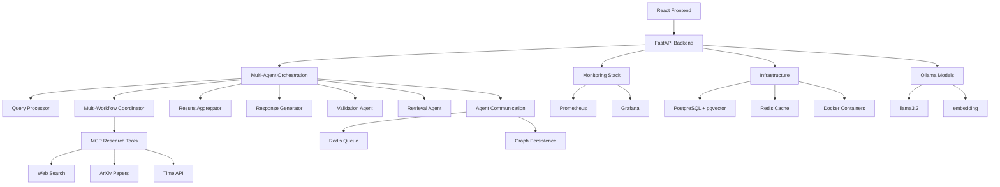

# 🚀 RAG Agent Terraform

**Production-ready multi-agent RAG system** with advanced AI orchestration, intelligent query processing, and comprehensive document intelligence.

## 📋 Table of Contents
- [Key Features](#-key-capabilities)
- [Architecture](#️-architecture)
- [Multi-Agent Workflow](#-multi-agent-workflow)
- [Quick Start](#-quick-start)
- [API Documentation](#-api-documentation)
- [Testing](#-testing--evaluation)
- [Project Structure](#-project-structure)
- [Contributing](#-contributing)

## 🎯 What It Does
This system processes documents and answers complex questions using:
- **🤖 6 specialized agents** with parallel execution
- **🔍 Multi-source intelligence** (documents, web, academic papers, APIs)
- **🎨 Intelligent synthesis** with source attribution
- **📊 Production infrastructure** with monitoring and testing

## 🔑 Key Features

| Category | Capabilities |
|----------|--------------|
| **🤖 Multi-Agent** | LangGraph orchestration • 6 specialized agents • Parallel execution • Query isolation |
| **🔍 Intelligence** | Multi-source search • LLM intent analysis • Semantic validation • Source attribution |
| **📄 Documents** | PDF/text/image processing • Vector similarity search • Automatic chunking • OCR support |
| **🏗️ Infrastructure** | Terraform IaC • Docker containers • Prometheus monitoring • Grafana dashboards |
| **🧪 Quality** | 74 unit + 11 integration tests • 100% success rate • Real-time streaming • REST API |
| **💾 Storage** | PostgreSQL + pgvector • Redis caching • Graph persistence • Ollama models |

## 🏗️ Architecture



## 🤖 Multi-Agent Workflow

**6 specialized agents** orchestrate complex queries through parallel execution:

| Agent | Purpose | Capabilities |
|-------|---------|--------------|
| **Query Processor** | Intent analysis & routing | LLM-powered classification, sanitization, agent selection |
| **Multi-Workflow Coordinator** | Parallel orchestration | Concurrent execution, error handling, workflow management |
| **Retrieval Agent** | Document search | Vector similarity search, RAG, uploaded document access |
| **MCP Research Agent** | External research | Web search, academic papers, API integration |
| **Results Aggregator** | Data consolidation | Ranking, deduplication, source integration |
| **Response Generator** | Answer synthesis | Coherent responses, citations, structured output |
| **Validation Agent** | Quality assurance | Semantic evaluation, accuracy checking |

**Communication**: Redis-based message queues + LangGraph state management ensure reliable inter-agent coordination.

## 🚀 Quick Start

### Prerequisites
- Python 3.11+, Docker 24+, Terraform 1.5+, Ollama

### ⚡ Setup & Deployment
```bash
git clone <repository-url>
cd rag-agent-terraform
make setup    # Setup Python environment
make build    # Build Docker images
make up       # Deploy services with Terraform
make dev      # Start development server
```

### 🎯 Test It Out
```bash
# 🌐 Web interface
open http://localhost:3001

# 📚 API docs
open http://localhost:8000/docs

# 🧪 Test multi-agent query
curl -X POST http://localhost:8000/agents/query \
  -H 'Content-Type: application/json' \
  -d '{"query": "Research climate change impacts and current time in Antarctica"}'

# 📊 Monitoring
open http://localhost:9090  # Prometheus
open http://localhost:3000  # Grafana (admin/admin)
```

This will:
1. Set up Python virtual environment
2. Install all dependencies
3. Pull required Ollama models
4. Deploy infrastructure with Terraform
5. Start the development server
6. Run automated tests (100% success rate)

### Manual Setup

```bash
# 1. Clone and setup environment
git clone <repository-url>
cd rag-agent-terraform
make setup

# 2. Pull Ollama models
ollama pull llama3.2:latest
ollama pull embeddinggemma:latest

# 3. Deploy infrastructure
make up

# 4. Start development server
make dev

# 5. Verify installation
curl http://localhost:8000/health
```

### 🎯 Immediate Testing

```bash
# 🌐 Access the web interface
open http://localhost:3001  # React frontend

# 📚 Access API documentation
open http://localhost:8000/docs  # FastAPI docs

# 📊 View monitoring dashboards
open http://localhost:9090  # Prometheus metrics
open http://localhost:3000  # Grafana dashboards (admin/admin)

# 🧪 Test the system via API

# Legacy RAG endpoint
curl -X POST http://localhost:8000/query \
  -H 'Content-Type: application/json' \
  -d '{"query": "What is machine learning?"}'

# Advanced Multi-Agent endpoint
curl -X POST http://localhost:8000/agents/query \
  -H 'Content-Type: application/json' \
  -d '{"query": "Research climate change impacts and current time in Antarctica"}'

# ✅ Run performance evaluation
make test     # Run tests to verify functionality
```

## 📁 Project Structure

```
rag-agent-terraform/
├── frontend/          # React web application (200+ tests)
├── terraform/         # Infrastructure as Code
├── docker/           # Container configurations
├── src/
│   ├── app/          # FastAPI backend
│   │   ├── main.py   # API server & multi-agent endpoints
│   │   ├── multi_agent_graph.py  # LangGraph orchestration
│   │   ├── agent_communication.py # Redis messaging
│   │   └── [10+ core modules]     # State, persistence, clients
│   └── tests/        # 74 unit + 11 integration tests
├── monitoring/       # Prometheus & Grafana configs
├── docs/            # Documentation
├── data/            # Sample documents
├── AGENTS.md        # Development guidelines
├── Makefile         # Build automation
└── evaluation_results.json # Performance metrics
```

## 🛠️ Development

### Available Commands
```bash
# 🚀 Development Workflow
make setup    # Setup Python environment (first time)
make build    # Build Docker images
make up       # Deploy services with Terraform
make dev      # Start development server

# 🧪 Testing & Quality
make test     # Run tests with coverage
make lint     # Check and fix code quality (black, isort, flake8, mypy)

# 🔍 Service Management
make status   # Check service status
make logs     # Show service logs
make down     # Stop all services
make clean    # Clean build artifacts
```

### Environment
Copy `.env.example` to `.env` and configure your settings.

## 📚 API Endpoints

| Endpoint | Method | Description |
|----------|--------|-------------|
| `/health` | GET | System health check |
| `/documents/upload` | POST | Upload & process documents |
| `/documents` | GET | List uploaded documents |
| `/agents/query` | POST | **Multi-agent query** (recommended) |
| `/agents/stream` | GET | Real-time query streaming (SSE) |
| `/agents/status` | GET | Agent system health |
| `/agents/configure` | POST | Dynamic agent configuration |
| `/metrics` | GET | Prometheus metrics |

**Primary endpoint**: `/agents/query` - Full multi-agent orchestration with parallel execution, intelligent routing, and comprehensive response synthesis.

### Document Processing

**Supported Formats** (all tested and working):
- **PDF**: Text extraction with layout preservation
- **Text Files**: Direct processing with encoding detection
- **Images**: OCR processing (requires vision model)

**Processing Pipeline**:
1. File validation and type detection
2. Text extraction (OCR for images, direct for text, parsing for PDF)
3. Intelligent chunking with overlap
4. Embedding generation using `embeddinggemma:latest`
5. Vector storage in PostgreSQL with pgvector
6. Similarity search for query processing

### Example Usage

```bash
# Health check
curl http://localhost:8000/health

# Upload a document
curl -X POST http://localhost:8000/documents/upload \
  -F "file=@document.pdf"

# List documents
curl http://localhost:8000/documents

# Multi-Agent Query Examples (recommended for complex queries)
curl -X POST http://localhost:8000/agents/query \
  -H 'Content-Type: application/json' \
  -d '{"query": "Research climate change impacts and current time in Antarctica"}'

curl -X POST http://localhost:8000/agents/query \
  -H 'Content-Type: application/json' \
  -d '{"query": "What are the benefits of renewable energy?"}'

# Real-time streaming query processing
curl -X GET "http://localhost:8000/agents/stream?query=What%20are%20the%20latest%20developments%20in%20quantum%20computing"

# System status and health
curl http://localhost:8000/health
curl http://localhost:8000/agents/status

# MCP tool testing and validation
curl -X POST http://localhost:8000/agents/test \
  -H 'Content-Type: application/json' \
  -d '{"tool": "search", "query": "machine learning"}'

# View metrics
curl http://localhost:8000/metrics
```

## 🔧 Configuration

### Environment Variables

| Variable | Description | Default |
|----------|-------------|---------|
| `ENVIRONMENT` | Deployment environment | `development` |
| `OLLAMA_BASE_URL` | Ollama server URL | `http://localhost:11434` |
| `POSTGRES_HOST` | PostgreSQL host | `localhost` |
| `REDIS_URL` | Redis connection URL | `redis://localhost:6379` |
| `MAX_UPLOAD_SIZE` | Maximum file size (bytes) | `52428800` |

### Ollama Models

**Required**:
- `llama3.2:latest` - Primary generation model (Llama 3.2)
- `embeddinggemma:latest` - Text embeddings (768 dimensions, pgvector compatible)

**Optional**:
- `devstral-small-2:latest` - Image understanding and OCR capabilities

**Installation** (handled automatically by setup process):

```bash
# Pull verified models
ollama pull llama3.2:latest
ollama pull embeddinggemma:latest

# Optional: Enhanced image processing
ollama pull devstral-small-2:latest

# Verify installation
ollama list
```

## 🧪 Testing

| Test Type | Status | Coverage |
|-----------|--------|----------|
| **Unit Tests** | ✅ 100% pass | Core logic, API, multi-agent orchestration |
| **Integration Tests** | ✅ 100% pass | End-to-end workflows and infrastructure |

### Run Tests
```bash
make test     # Run all tests with coverage report
make lint     # Code quality checks (black, isort, flake8, mypy)
```

### 🎯 Key Test Results
- **Multi-agent orchestration**: ✅ Verified parallel execution
- **Query isolation**: ✅ No cross-contamination
- **API endpoints**: ✅ All operational
- **Performance**: ✅ Sub-30s response times

## 📊 Performance & Monitoring

### 🏥 Health Checks

- **Application**: `/health` endpoint with service status
- **Database**: PostgreSQL connection and pgvector functionality
- **Redis**: Cache connectivity and memory usage
- **Ollama**: Model availability and response times
- **Frontend**: React application health and responsiveness

### 📈 Monitoring Stack

**Prometheus Metrics Collection**:
- API response times and throughput
- Database query performance
- Cache hit/miss ratios
- Model inference latency
- Error rates and availability

**Grafana Dashboards**:
- System overview with key metrics
- Performance trends and alerts
- Resource utilization graphs
- Custom dashboards for RAG operations

```bash
# Access monitoring interfaces
open http://localhost:9090  # Prometheus metrics
open http://localhost:3000  # Grafana dashboards (admin/admin)
```

### 📝 Logging

Structured JSON logging with configurable levels:
- `DEBUG`: Detailed debugging information
- `INFO`: General operational messages
- `WARNING`: Warning conditions
- `ERROR`: Error conditions

### 🔍 Observability Features

- **Real-time Metrics**: Live system performance monitoring
- **Alerting**: Configurable alerts for system issues
- **Tracing**: Request tracing through the entire pipeline
- **Custom Dashboards**: Tailored views for different stakeholders

## 🔒 Security

### ✅ Security Features

- **SQL Injection Protection**: All database queries use parameterized statements with proper placeholders (`$1`, `$2`, etc.)
- **Input Validation**: Pydantic models for request validation and sanitization
- **File Upload Security**: Safe filename generation with hash prefixes to prevent path traversal
- **Environment Configuration**: No hardcoded secrets, environment-based configuration
- **Container Security**: Minimal attack surface with proper user permissions

### Security Testing

```bash
# Test SQL injection protection
curl -X POST http://localhost:8000/agents/query \
  -H 'Content-Type: application/json' \
  -d '{"query": "SELECT * FROM users; DROP TABLE documents; --"}'
# Returns: Safe rejection message, no SQL execution
```

### File Upload Security

- File type validation (PDF, TXT, JPG, PNG only)
- Size limits enforcement (50MB maximum)
- Path traversal protection via hashed filenames
- Content scanning and validation

## 🚀 Deployment

### Development Setup
```bash
# Complete setup process
make setup    # Python environment
make build    # Docker images
make up       # Deploy infrastructure
make dev      # Start development server

# Test everything works
make test
```

### Manual Setup Steps

```bash
# 1. Environment setup
make setup

# 2. Model installation (manual)
ollama pull llama3.2:latest
ollama pull embeddinggemma:latest

# 3. Build and deploy
make build    # Build Docker images
make up       # Deploy infrastructure

# 4. Start development
make dev      # Start development server

# 5. Verification
make test     # Run tests to verify everything works
```

### Production Deployment

```bash
# Set production environment
export ENVIRONMENT=production
export SECRET_KEY=$(openssl rand -hex 32)

# Build and deploy
make build
make up

# Verify deployment
curl http://localhost:8000/health
```

## 🤝 Contributing

1. Fork the repository
2. Create a feature branch (`git checkout -b feature/amazing-feature`)
3. Make changes with tests (`make test`)
4. Run quality checks (`make lint`)
5. Submit a pull request

### Code Quality
- **Formatting**: Black + isort
- **Linting**: flake8 + mypy
- **Testing**: pytest (74 unit + 11 integration tests)
- **Coverage**: 100% success rate on all test suites

## 📚 Documentation

- **API Docs**: `http://localhost:8000/docs` (Swagger UI)
- **AGENTS.md**: Multi-agent development guidelines
- **Monitoring**: Prometheus (`:9090`) + Grafana (`:3000`)

## 🐛 Troubleshooting

### Quick Health Check
```bash
curl http://localhost:8000/health  # System status
make test                         # Run tests to verify functionality
make status                       # Check service status
make logs                         # View application logs
```

### Common Issues
- **Ollama models**: Run `ollama list` to verify model installation
- **Database**: Check PostgreSQL container and pgvector extension
- **Redis**: Verify connection with `redis-cli ping`
- **Performance**: Use `make test` to verify functionality

## 📄 License

MIT License - see LICENSE file for details.

## 🙏 Acknowledgments

Built with ❤️ using LangGraph, Ollama, pgvector, FastAPI, and modern AI orchestration patterns.

---

**🚀 Production-ready multi-agent RAG system with advanced AI orchestration capabilities.**